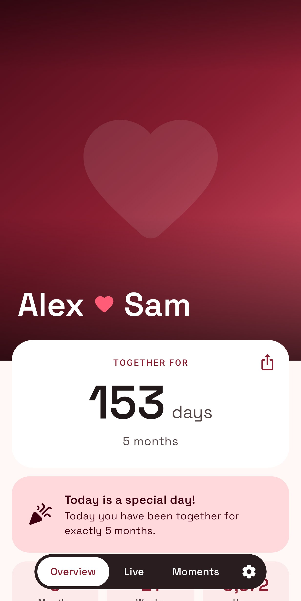
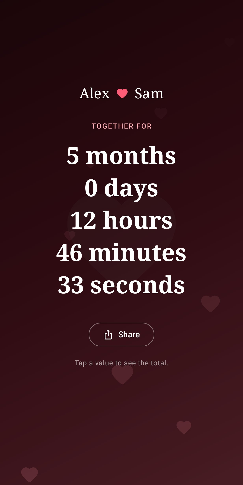
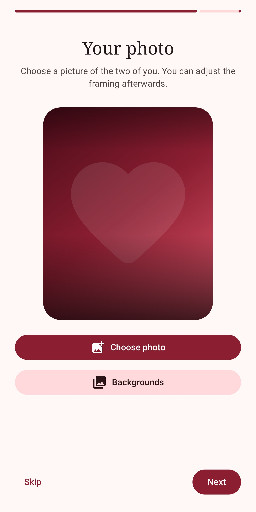

# Since Us ❤

A privacy-friendly Android app for couples: counts how long you have been together and reminds you of every special day. Available in English and German.

  
  
  

## Features

- Days, weeks, months and hours together, plus a live counter down to the second
- Your own photo with adjustable framing, or one of several backgrounds
- Notifications on monthly and yearly anniversaries, every 100 days, fun numbers like 222 and every 50 weeks, at a time you choose
- Upcoming special days with a countdown
- Moments: a timeline of important moments with note, photo and yearly reminder (can be hidden)
- Two home screen widgets: your photo with your days together, and a compact counter in Material You colors
- Guided setup, optional start time, one-tap "delete all data"
- Light and dark mode, English and German (per-app language supported)
- No account, no ads, no tracking, all data stays on the device

## Third-party libraries

Since Us uses Android Jetpack (AndroidX, Jetpack Compose, Material 3, Glance, DataStore), Kotlin and kotlinx.coroutines, Coil, Okio, Guava ListenableFuture, Accompanist, JSpecify and Material Symbols. All of them are licensed under the [Apache License 2.0](https://www.apache.org/licenses/LICENSE-2.0). The app lists them under *Settings → Open source licenses*.

## Download

| Where | Updates |
| --- | --- |
| [GitHub Releases](https://github.com/DerDieDasLian/sinceus/releases) | The app checks GitHub once a day, notifies you and installs the update with one tap (can be turned off). Also works with [Obtainium](https://github.com/ImranR98/Obtainium). |
| F-Droid | Through F-Droid (planned) |
| Google Play | Through the Play Store (planned) |

The three versions are signed differently, so switching between them requires uninstalling first.

Tip: if notifications arrive late, set *Settings → Apps → Since Us → Battery* to "Unrestricted".

## Build variants

| Variant | Gradle task | Internet | Updates |
| --- | --- | --- | --- |
| `github` | `./gradlew assembleGithubRelease` | only for the update check | GitHub Releases |
| `fdroid` | `./gradlew assembleFdroidRelease` | none | F-Droid |
| `play` | `./gradlew bundlePlayRelease` | none | Google Play |

Tests, screenshots and store graphics: `./gradlew testGithubDebugUnitTest` (output in `app/build/screenshots` and `app/build/store`).

## Releasing

- **Signing:** create `keystore.properties` (not committed) with `storeFile`, `storePassword`, `keyAlias`, `keyPassword`. Without it, release builds stay unsigned (this is what F-Droid expects). In GitHub Actions the secrets `UPLOAD_KEYSTORE_BASE64`, `UPLOAD_KEYSTORE_PASSWORD`, `UPLOAD_KEY_ALIAS` and `UPLOAD_KEY_PASSWORD` are used.
- **GitHub releases are automatic:** every push to the default branch that changes `app/` bumps the version (patch by default, `[minor]` or `[major]` in a commit message for bigger steps), commits it back, tags `v<versionName>` and publishes the signed APK. A manually raised `versionName` is respected. Release notes come from `fastlane/metadata/android/en-US/changelogs/<versionCode>.txt` and are generated from commit messages if missing. Pull before working, since the release workflow pushes version commits.
- **F-Droid** builds the `fdroid` variant from source; store texts and images are in `fastlane/`, a metadata template is in `fdroid/`.
- **Website:** `docs/` (landing page and privacy policy) is published via GitHub Pages and can be copied to any static web server.

## Tech

Kotlin, Jetpack Compose (Material 3), Glance widgets, DataStore, Coil. Minimum Android 8.0.

## Website

https://derdiedaslian.github.io/sinceus/ (privacy policy: [English](docs/privacy-en.html), [Deutsch](docs/privacy-de.html))

## How this app was made

This app was developed with AI assistance: the code was written with the help of an AI coding assistant and reviewed, tested and directed by the maintainer.

## License

[GNU General Public License v3.0 or later](LICENSE)
